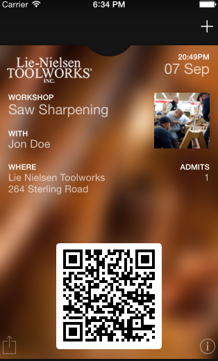

Nereid Passbook
===============

Apple Passbook integration for Nereid.

Easily create passbook passes and leave the rest to this module to handle
updates.

Screenshot
------------


Basics
------

Creating passesti require you to have an apple developer account and a
certificate issued by apple that can be used to sign/verify the passes.
This section explains how you can get one and use it with this module.


1. Create a Pass Type ID
````````````````````````

On the `apple developer portal <https://developer.apple.com/account/ios/identifiers/passTypeId/passTypeIdList.action>`_
create a new Pass Type ID and give it a ``description`` and ``ID``. Click
`continue` and then `Register`. Hit `Done` and then select the newly
created Pass Type ID and click Edit. You should be shown the screen where
you can create a new certificate for the Pass Type. Click on `Create
Certificate` and then follow instructions on the next step.

2. Generating a certificate
````````````````````````````

Creating a certificate requires a CSR (A request to generate the
certificate). To generate such a certificate you also need a private key.
We recommend that you create a new private key for the purpose of the
passbook as the key will be deployed on all the servers where you will
have to generate passes.

The instructions to create a new CSR should be available on the apple
developer portal if you followed the above step. Once you upload the CSR
apple should create a new certificate for you, which could be downloaded
in the subsequent step.

3. Export certificate and private key as pem files
``````````````````````````````````````````````````

This module uses the ``passbook`` python package which requires the key
and certificate to be in the pem format for it to work.

To export the downloaded ``pass.cer`` (certificate) to PEM format::

    openssl x509 -inform der -in /path/to/pass.cer -out certificate.pem

The private key has to be first exported from keychain to a supported
format and then converted to ``pem`` file. The usual export option of private
keys is to a ``p12`` file::

    openssl pkcs12 -in /path/to/exported/private-key.p12 -out key.pem

Installation of the module
--------------------------

The key requirement of the module is the ``M2Crypto`` package which is a
pain in the butt to build and run. The easy approach is to install it using
your OS package manager. For example, in Ubuntu::

    sudo apt-get install python-m2crypto

Once M2Crypto is installed, the module can be installed using pip::

    pip install openlabs_nereid_passbook

Or download the module source and then run::

    python setup.py install

Configuration
-------------

The certificate and key generated in step 1 should be made available to
the Tryton configuration subsystem. For this add a new section to your
tryton configuration::

    [nereid_passbook]
    certificate = /path/to/certificate.pem
    key = /path/to/key.pem
    pass_type_identifier = pass.com.your.organization
    team_identifier = AGK5BZEN3E

If you do not know your team identifier, navigate to the home page of the
apple ``Member Center`` and click on 
`your organization <https://developer.apple.com/membercenter/index.action#profile>`_. 
The team id would be displayed in the organization profile.

TODO
----

* Support for push notifications to update passes.
* Add a model to keep the logs sent from devices. (Currently spits to the
  log file of tryton).

Implementations
---------------

* Nereid Event Sales - Sends event tickets as passes.

Authors and Contributors
------------------------

This module was built at `Openlabs <http://www.openlabs.co.in>`_. 

Professional Support
--------------------

This module is professionally supported by `Openlabs <http://www.openlabs.co.in>`_.
If you are looking for on-site teaching or consulting support, contact our
`sales <mailto:sales@openlabs.co.in>`_ and `support
<mailto:support@openlabs.co.in>`_ teams.
